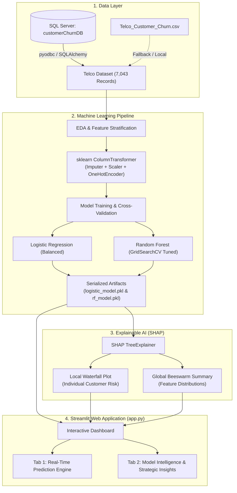

<div align="center">
  
  <h1>🛡️ ChurnShield — AI-Powered Customer Churn Prediction System</h1>
</div>

<p align="center">
  <a href="https://customer-churn-prediction-churnshield.streamlit.app/" target="_blank">
    
  </a>
  &nbsp;&nbsp;
  <a href="https://churnshield-mwt7.onrender.com/" target="_blank">
    
  </a>
</p>

<p align="center">
  
  
  
  
  
  
</p>

> 🌐 **Live Cloud Applications:**
> - **Streamlit Community Cloud:** **[https://customer-churn-prediction-churnshield.streamlit.app/](https://customer-churn-prediction-churnshield.streamlit.app/)**
> - **Render Web Service:** **[https://churnshield-mwt7.onrender.com/](https://churnshield-mwt7.onrender.com/)**

An enterprise-grade, end-to-end Machine Learning solution designed to predict customer churn in the telecommunications sector. **ChurnShield** combines production-ready Scikit-Learn pipelines, hyperparameter-tuned ensemble models, Explainable AI (SHAP), and an interactive dark-themed Streamlit dashboard delivering real-time churn risk scores and data-backed retention strategies.

---

## 📌 Project Highlights & Key Features

- **End-to-End Data Lifecycle**: SQL Server schema design $\rightarrow$ Automated ETL $\rightarrow$ Exploratory Data Analysis $\rightarrow$ Pipeline Serialization $\rightarrow$ Web App Deployment.
- **Leakage-Free Preprocessing**: Bundled `ColumnTransformer` with median imputation, standard scaling, and one-hot encoding (`handle_unknown='ignore'`).
- **Class Imbalance Mitigation**: Addressed the ~26% natural churn imbalance using stratified splits (`stratify=y`) and balanced class weighting (`class_weight='balanced'`).
- **Model Diversity**: Direct comparison between interpretable linear baselines (**Logistic Regression**) and non-linear ensembles (**Random Forest** tuned with `GridSearchCV`).
- **Explainable AI (XAI)**:
  - **Local Interpretability**: Customer-level SHAP Waterfall plots revealing specific push/pull factors.
  - **Global Interpretability**: Population-level SHAP Beeswarm distributions and Mean absolute $|SHAP|$ rankings.
- **Modern Executive Dashboard**: Built with Streamlit featuring responsive glassmorphic cards, custom vector icons, risk assessment tiers, and actionable retention playbooks.

---

## 🔄 End-to-End Workflow Architecture



---

## 📊 Model Performance Comparison

Evaluated on an independent, stratified 30% test holdout:

| Metric | Logistic Regression (Baseline) | Random Forest (Best Tuned) | Key Takeaway |
| :--- | :---: | :---: | :--- |
| **ROC AUC** | **0.86** | **0.85** | High discriminatory power across classification thresholds |
| **Recall (Churn)** | **0.84** | 0.78 | Catches 84% of all at-risk customers (minimizes false negatives) |
| **Precision** | 0.52 | **0.56** | Random Forest reduces false alarms |
| **F1 Score** | 0.64 | **0.65** | Balanced harmonic mean between precision and recall |

---

## 💡 Key Business Drivers & Strategic Recommendations

Based on SHAP and feature importance analyses, the primary churn drivers are:

1. **Contract Type**: Month-to-month subscribers exhibit the highest churn probability. Long-term (1-year and 2-year) contracts dramatically increase retention.
   - *Action*: Offer tiered introductory discounts or fee waivers for upgrading to annual contracts.
2. **Customer Tenure**: High attrition occurs during the initial 1–6 months of customer onboarding.
   - *Action*: Trigger automated proactive onboarding check-ins and customer success support during month 1 and 3.
3. **Monthly Charges & Fiber Optic**: Higher monthly spending combined with Fiber Optic service correlates with elevated churn if service expectations aren't met.
   - *Action*: Bundle value-added services (Online Security, Device Protection) to heighten perceived value.

---

## 📁 Repository Directory Structure

```plaintext
Customer Churn Prediction/
├── dataset/
│   └── Telco_Customer_Churn.csv    # Source telecommunications dataset (7,043 rows)
├── assets/
│   └── logo.png                    # Project visual branding logo
├── schema.sql                      # Production SQL Server DDL schema with indexes & constraints
├── .env.example                    # Environment variable template for database credentials
├── .env                            # Local configuration (ignored by Git)
├── .gitignore                      # Git exclusion rules for caches, secrets, and environments
├── requirements.txt                # Pinned and tested Python dependencies
├── work.ipynb                      # Complete data science notebook (EDA, training, tuning, XAI)
├── logistic_model.pkl              # Serialized Logistic Regression pipeline
├── rf_model.pkl                    # Serialized Random Forest pipeline with preprocessor
├── app.py                          # Main Streamlit web application
└── README.md                       # Comprehensive documentation
```

---

## 🚀 Quickstart & Setup Guide

### 1. Prerequisites
- **Python 3.10+**
- **Microsoft ODBC Driver 18 for SQL Server** (if connecting to a live SQL Server instance)

### 2. Clone and Setup Environment
```bash
# Clone the repository
git clone https://github.com/your-username/Customer-Churn-Prediction.git
cd "Customer Churn Prediction"

# Create a virtual environment
python -m venv venv

# Activate virtual environment
# Windows (PowerShell):
.\venv\Scripts\Activate.ps1
# Linux / macOS:
source venv/bin/activate
```

### 3. Install Dependencies
```bash
pip install -r requirements.txt
```

### 4. Configure Environment Variables
Copy `.env.example` to `.env` and set your SQL Server instance name:
```bash
cp .env.example .env
```
Inside `.env`:
```env
SQL_SERVER=YOUR_SQL_SERVER_NAME
SQL_DATABASE=customerChurnDB
SQL_DRIVER=ODBC Driver 18 for SQL Server
```

### 5. (Optional) Initialize SQL Server Database
Run [schema.sql](file:///d:/Data%20Science/Customer%20Churn%20Prediction/schema.sql) in SQL Server Management Studio (SSMS) or Azure Data Studio to create `customerChurnDB` and `dbo.CustomerChurn` table.

### 6. Launch the Streamlit Dashboard
```bash
streamlit run app.py
```
Open your browser at `http://localhost:8501`, or test the live cloud instances on **[Streamlit Community Cloud](https://customer-churn-prediction-churnshield.streamlit.app/)** or **[Render](https://churnshield-mwt7.onrender.com/)**.

---

## 🖥️ Application Interface Overview

- **Tab 1: Prediction Engine**:
  - Input custom customer parameters across 5 profile cards (Demographics, Tenure, Phone, Internet, Billing).
  - Select between **Logistic Regression** and **Random Forest**.
  - Receive an instant churn probability gauge, categorized risk tier (*Low*, *Medium*, *High Risk*), and an individual **SHAP Waterfall Explanation**.
- **Tab 2: Model Intelligence & Insights**:
  - Gini-based feature importance ranking.
  - Population-wide **SHAP Beeswarm Distribution** computed on representative customer samples.
  - Mean $|SHAP|$ global feature impact.
  - Head-to-head model performance metrics table and executive business strategies.

---

## 🛠️ Technology Stack

- **Modeling & Analytics**: `scikit-learn`, `joblib`, `shap`, `numpy`, `pandas`
- **Visualization**: `matplotlib`, `seaborn`
- **Application Delivery**: `streamlit`
- **Database Connectivity**: `SQLAlchemy`, `pyodbc`, `python-dotenv`
- **Database Engine**: Microsoft SQL Server (T-SQL)

---

## 📜 License
Distributed under the MIT License. Feel free to use and adapt this project for educational or commercial purposes.
